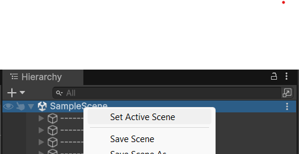
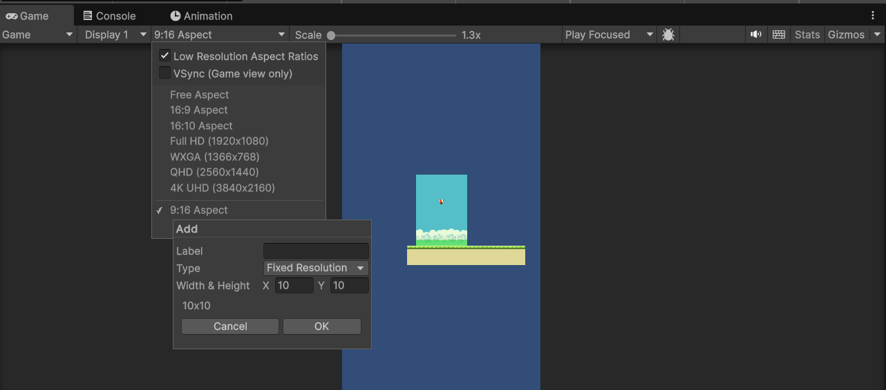
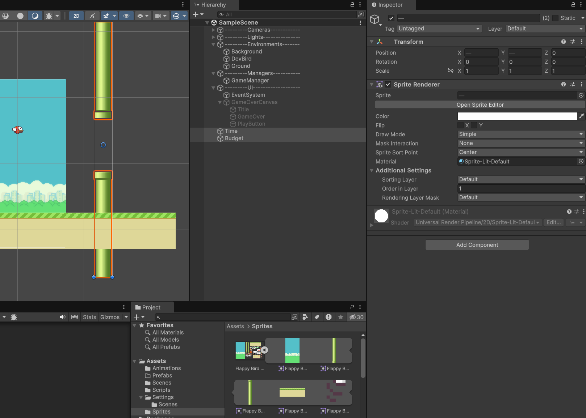
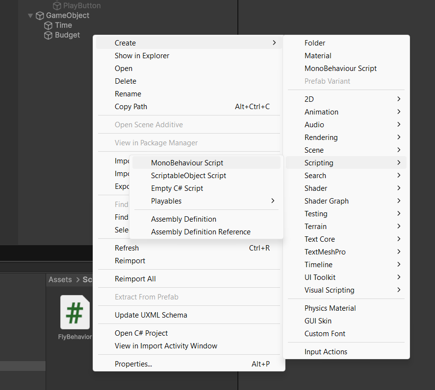
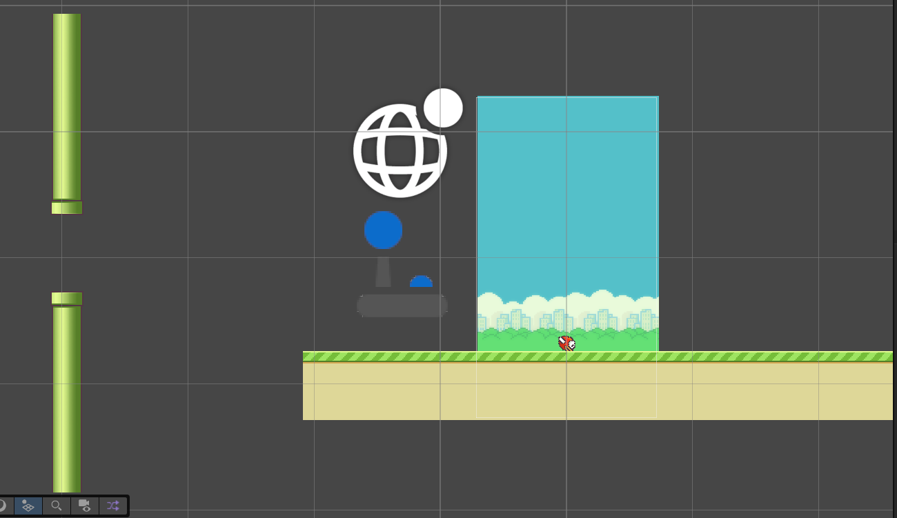
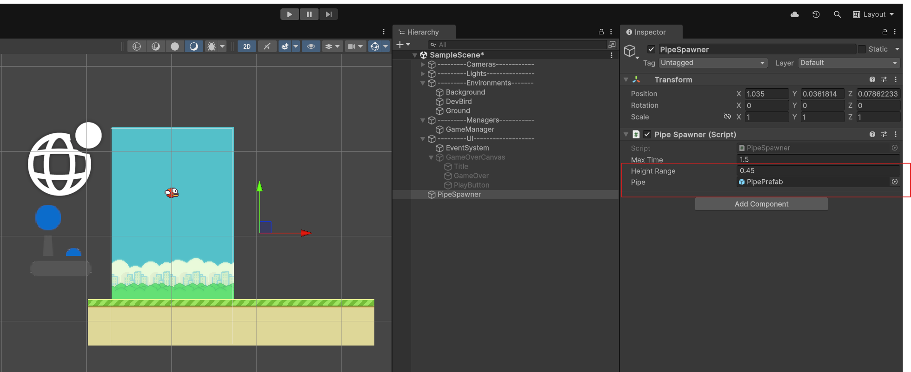

# Unity Hands-on

This repository is for the hand-on part in the unity session for the Dev-Days.

## Prerequisite

- Unity 6 and Unity Hub installed
- Unity Account created and a valid free licence
- Any editor installed to modify the code (VS, VSCode, Rider...)

## First Steps

1. Download the repository
2. Open the Unity Hub
3. Under Projects select Add - Add from project disk - Select the folder
4. In the Unity Hub - Open the project by clicking on the project row, this will take a while

## Tutorial

### Scene

1. Delete the scene under the hierarchy window.
2. Go to the project section in unity and select scenes, then drag and drop the SampleScene into the Hierarchy window.
3. Select the new Scene as active
   
4. In the Game window select the 9x16 Resolution. 
   If it is not available - create it by pressing the + sign at the bottom, select Aspect Ration and enter 9x16.
   

### Missing something?

As we know each dev bird has to be within time and budget. So we need to create those restrictions in the game.

1. From the sprites folder - open the sprite and drag and drop both pipes into the Scene
2. Rename the top pipe to **Time** and the bottom pipe to **Budget**.
3. Set the order layout in the Inspector window to 1 for both Time and Budget.
   _The order indicates which sprite is on top of which other. The current setup has the background on 0, bird on 1 and the bottom on 2_
   
4. Set the Y position of Time to 1.1 and the -1.1 for the Budget. Make sure both pipes are in a straight line.
5. Create an empty GameObject in the Hierarchy tab, rename it to PipePrefab and move both Time and Budget to that GameObject
6. Add a BoxCollider 2 Component to each of the pipes. For this select one pipe and press _Add Component_ in the Inspector Tab. Search for "BoxCollider 2D" and click on it. This will tell the engine that those sprites have a collider and we get some events if the dev bird is not withing time and budget.
7. Now we need some code. For this create a new Monobehaviour Script in the Project Tab under Scripts. Name it MovePipe.
   
8. Drag and Drop the script to the PiepPrefab GameObject or if you have the PipePrefab selected, drag the script to the _Add Component_ section.
9. Open the script by double clicking in the Project tab - depending on your settings this will open Visual Studio, Rider oder VSCode.
10. Add the following Code in the Script:

```C#
using UnityEngine;

public class MovePipe : MonoBehaviour
{
    // Set a speed value, this will be visible in the unity editor in the inspector section
    [SerializeField] private float _speed = 0.65f;

    private void Update()
    {
        //move the gameobject left by the given speed and time
        transform.position += Vector3.left * _speed * Time.deltaTime;
    }
}
```

11. Close the script and go back to the editor, which will take some times to get the changes and reload thes scripts. If everything is fine - you will see the updated script on the Inspector tab.
12. Try to run the game now and see what happens.

### Prefab and Spawner

Something is missing. We are only creating one set of pipes and they will go left all the way. This is not a problem for one set but if we create multiple pipes we have to delete them as soon as they are not in the screen anymore.


So we need some kind of a spawner which will create pipes. For this we first have to make the pipes a _prefab_. This means that we create a template for an object which we can instanciate as much as we want. Any edits on the prefab is also reflected in all instances produced.

#### Prefab

1. Select the Prefab folder in the Project tab
2. Drag and drop the PipePrefab into the folder
3. Delete the PipePrefab in the Hierarchy.

If you need do change something in the prefab or if you missed some steps, just double click the prefab and it will open again to modify it.

#### Spawner

1. Create a new GameObject and rename it to PipeSpawner.
2. Move it to the Managers Scene.
3. Create a Monobehaviorscript with the same name in the correct folder and add it the PipeSpawner.
4. Open up the script and add the following code

```C#
using UnityEngine;

public class PipeSpawner : MonoBehaviour
{
    [SerializeField] private float _maxTime = 1.5f;
    [SerializeField] private float _heightRange = 0.45f;
    [SerializeField] private GameObject _pipe;

    private float _timer;
    // Start is called once before the first execution of Update after the MonoBehaviour is created
    void Start()
    {
        SpawnPipe();
    }

    // Update is called once per frame,

    void Update()
    {
        if(_timer > _maxTime){
            // create new pipes after 1.5 seconds
            SpawnPipe();
            // reset timer
            _timer = 0;
        }
        // increment time with time passed
        _timer += Time.deltaTime;
    }

    private void SpawnPipe(){
        //create a new vector for the spawning position - part of it is random so that the pipe oppenings are not all the same
        Vector3 spawnPos = transform.position + new Vector3(0, Random.Range(-_heightRange, _heightRange));
        //Instantiate lets you create an object
        GameObject pipe = Instantiate(_pipe, spawnPos, Quaternion.identity);

        //Destroy lets you destroy an object if the given time is passed (here 10 seconds).
        Destroy(pipe, 10f);
    }
}
```

5. Close the file and go back to the editor
6. Next we need to add the prefab to the script. For this click on the PipeSpawner GameObject and drag and drop the PipePrefab to the corresponding Pipe in the Inspector tab
   

## Test

Run the game again and see the changes.

## Already finished and still time left?

Can you change the input for the bird to use the spacebar instead of the mouse key?

What do you need to do if you want the player to not get outside of the screen with the dev bird?

Think of way to add a score, which increments if the bird passes through the pipes.

<details>
<summary>Hints for the score</summary>

- you will need some text in the UI
- a counter variable, reset on a new game
- a collision object between the pipe with a trigger
- logic which increments the counter

**for more hints, have a look at this [Video](https://youtu.be/hKGzSYXPQwY?t=264)**

</details>

## Disclaimer

The idea for this template comes from this
[Youtube Video](https://www.youtube.com/watch?v=hKGzSYXPQwY), which gives you all the information to start a flappy bird application from scratch withouth any template solution.
